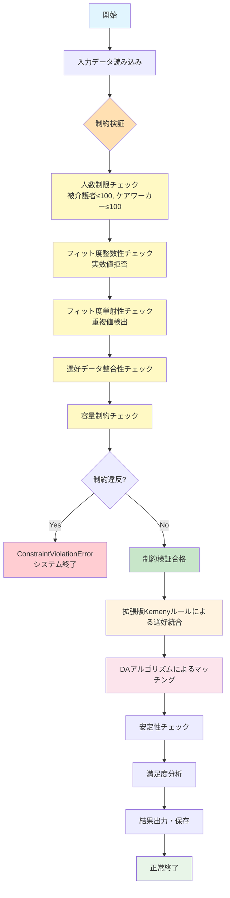
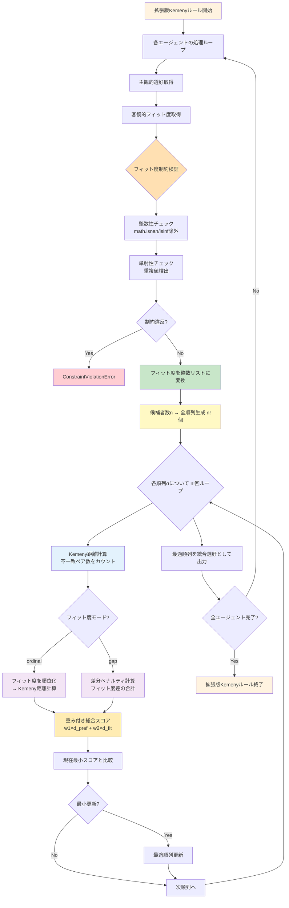
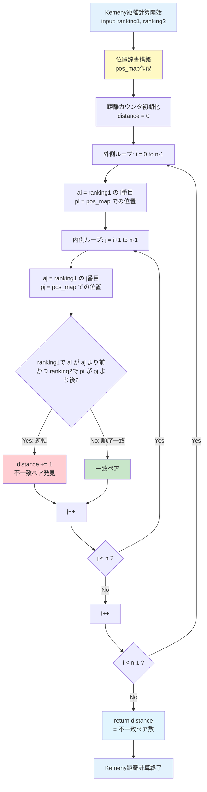
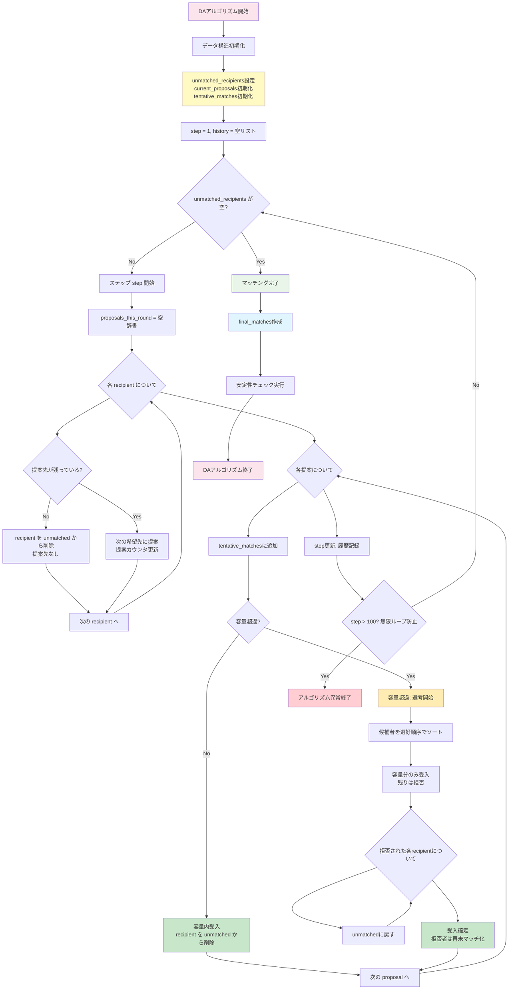
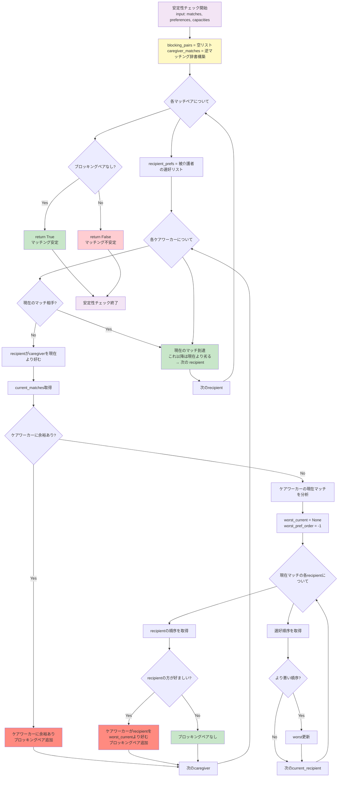
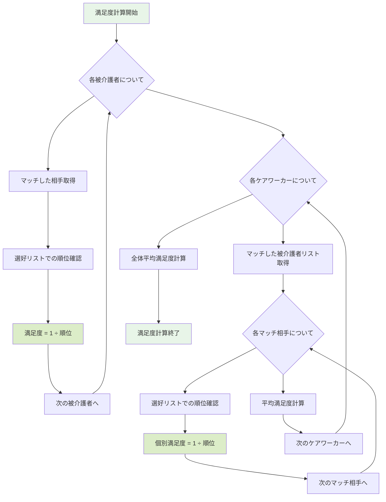
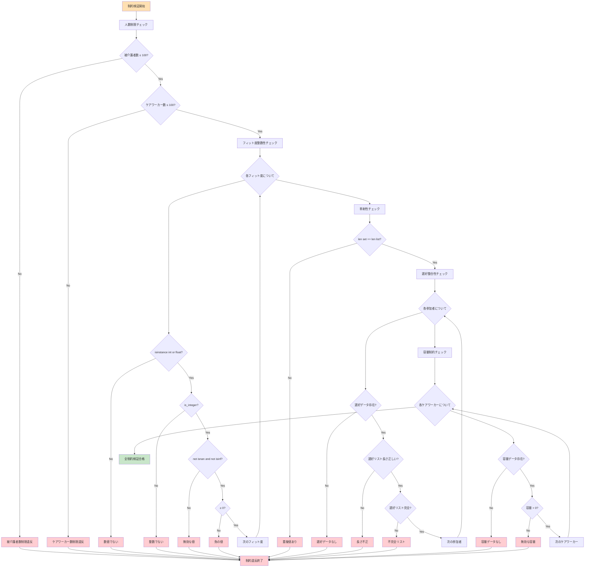
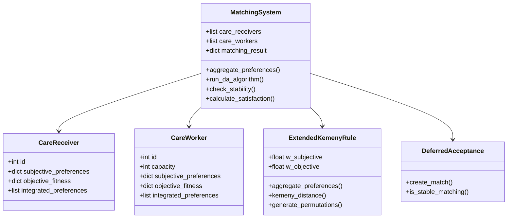
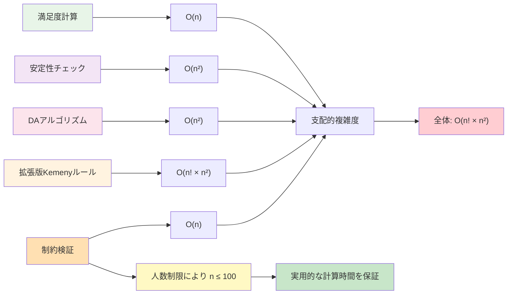
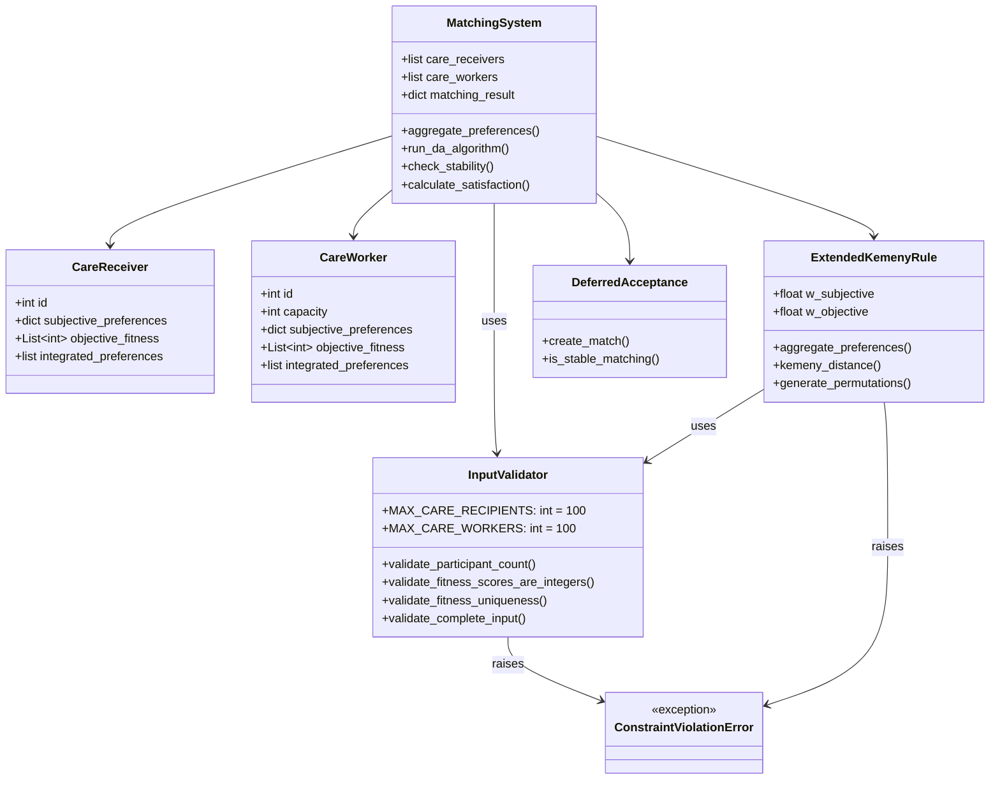

# ケアワーカー・被介護者マッチングシステム アルゴリズムフローチャート

## 全体システムフロー

## 拡張版Kemenyルール詳細フロー（制約検証統合版）

## Kemeny距離計算詳細（O(n²) 最適化版）

## DAアルゴリズム詳細フロー（被介護者提案型）

## 安定性チェックフロー（ブロッキングペア検出）

## 満足度計算フロー

## 制約検証フロー（2025年9月追加）

## データ構造関係図

## 時間複雑度分析（制約検証統合版）

## データ構造関係図（制約対応版）

