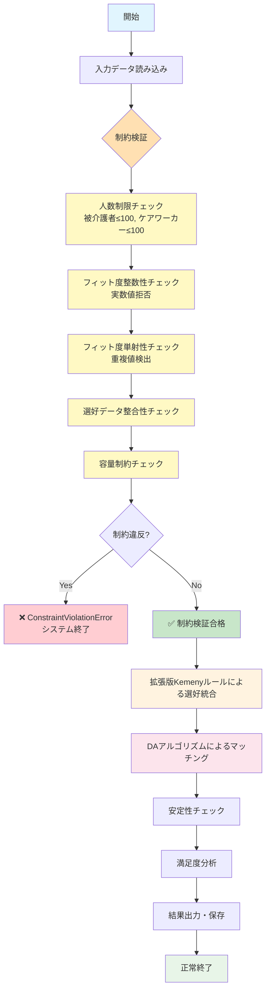
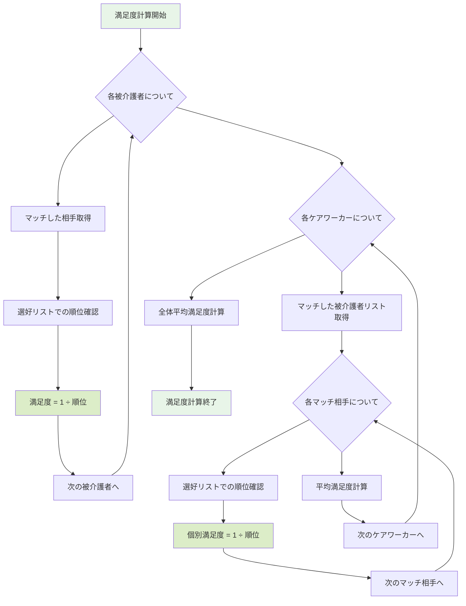
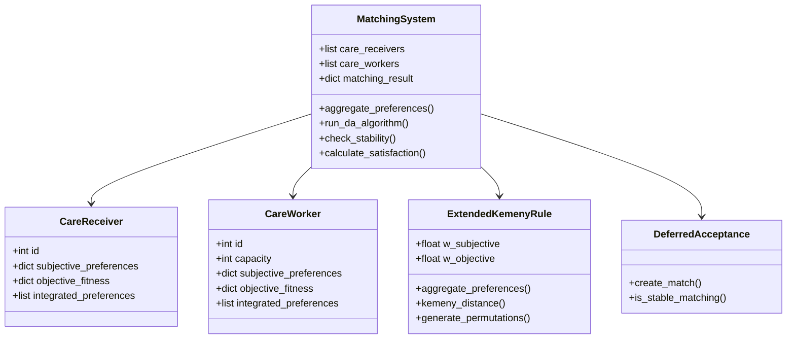
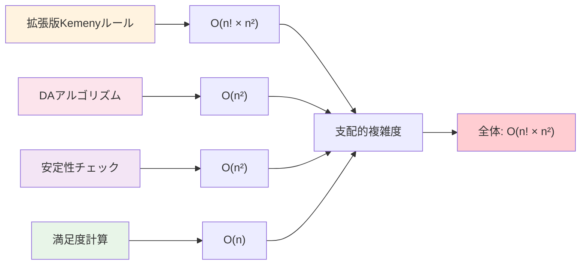

# ケアワーカー・被介護者マッチングシステム アルゴリズムフローチャート
## 【2025年9月更新】厳格な制約条件対応版

## 全体システムフロー（制約検証統合版）



## 拡張版Kemenyルール詳細フロー（制約検証統合版）

```mermaid
flowchart TD
    A1[拡張版Kemenyルール開始] --> B1[各エージェントの処理ループ]
    B1 --> C1[主観的選好取得: List[int]]
    C1 --> D1[客観的フィット度取得: List[Union[int,float]]]
    D1 --> E1{フィット度制約検証}
    E1 --> E1a[整数性チェック<br/>math.isnan/isinf除外]
    E1a --> E1b[単射性チェック<br/>重複値検出]
    E1b --> E1c{制約違反?}
    E1c -->|Yes| ERROR1[❌ ConstraintViolationError]
    E1c -->|No| F1[✅ フィット度を整数リストに変換]
    F1 --> G1[候補者数n → 全順列生成 n!個]
    G1 --> H1{各順列σについて n!回ループ}
    H1 --> I1[Kemeny距離計算<br/>Σ(i<j) I(σ⁻¹(i) > σ⁻¹(j))]
    I1 --> J1{フィット度モード?}
    J1 -->|ordinal| J1a[フィット度を順位化<br/>→ Kemeny距離計算]
    J1 -->|gap| J1b[差分ペナルティ計算<br/>Σ max(0, f[j]-f[i])]
    J1a --> K1[重み付き総合スコア<br/>w₁×d_pref + w₂×d_fit]
    J1b --> K1
    K1 --> L1[現在最小スコアと比較]
    L1 --> M1{最小更新?}
    M1 -->|Yes| M1a[最適順列更新]
    M1 -->|No| N1[次順列へ]
    M1a --> N1
    N1 --> H1
    H1 --> O1[最適順列を統合選好として出力]
    O1 --> P1{全エージェント完了?}
    P1 -->|No| B1
    P1 -->|Yes| Q1[拡張版Kemenyルール終了]
    
    style A1 fill:#fff3e0
    style Q1 fill:#fff3e0
    style ERROR1 fill:#ffcdd2
    style F1 fill:#c8e6c9
    style K1 fill:#ffecb3
    style E1 fill:#ffe0b2
    style G1 fill:#fff9c4
    style I1 fill:#e3f2fd
    style J1a fill:#f3e5f5
    style J1b fill:#f3e5f5
```

## Kemeny距離計算詳細（O(n²) 最適化版）

```mermaid
flowchart TD
    A2[Kemeny距離計算開始<br/>input: ranking1, ranking2] --> B2[位置辞書構築<br/>pos_map = {elem: i for i, elem in enumerate(ranking2)}]
    B2 --> C2[距離カウンタ初期化<br/>distance = 0]
    C2 --> D2[外側ループ: i ∈ [0, n-1]]
    D2 --> E2[ai = ranking1[i]<br/>pi = pos_map[ai]]
    E2 --> F2[内側ループ: j ∈ [i+1, n-1]]
    F2 --> G2[aj = ranking1[j]<br/>pj = pos_map[aj]]
    G2 --> H2{ranking1で ai < aj<br/>かつ ranking2で pi > pj ?}
    H2 -->|Yes: 逆転| I2[distance += 1<br/>🔴 不一致ペア発見]
    H2 -->|No: 順序一致| J2[🟢 一致ペア]
    I2 --> K2[j++]
    J2 --> K2
    K2 --> L2{j < n ?}
    L2 -->|Yes| F2
    L2 -->|No| M2[i++]
    M2 --> N2{i < n-1 ?}
    N2 -->|Yes| D2
    N2 -->|No| O2[return distance<br/>= 不一致ペア数]
    O2 --> P2[Kemeny距離計算終了]
    
    style A2 fill:#e3f2fd
    style P2 fill:#e3f2fd
    style B2 fill:#fff9c4
    style I2 fill:#ffcdd2
    style J2 fill:#c8e6c9
    style O2 fill:#e1f5fe
```

## DAアルゴリズム詳細フロー（被介護者提案型）

```mermaid
flowchart TD
    A3[DAアルゴリズム開始] --> B3[データ構造初期化]
    B3 --> C3[unmatched_recipients = set(all_recipients)<br/>current_proposals = {r: 0 for r in recipients}<br/>tentative_matches = {c: [] for c in caregivers}]
    C3 --> D3[step = 1, history = []]
    D3 --> E3{unmatched_recipients が空?}
    E3 -->|Yes| FINAL[マッチング完了]
    E3 -->|No| F3[ステップ step 開始]
    F3 --> G3[proposals_this_round = {}]
    G3 --> H3{各 recipient ∈ unmatched_recipients}
    H3 --> I3{current_proposals[recipient] < len(preferences)?}
    I3 -->|No| I3a[recipient を unmatched から削除<br/>提案先なし]
    I3 -->|Yes| J3[target = preferences[recipient][current_proposals[recipient]]<br/>proposals_this_round[recipient] = target<br/>current_proposals[recipient] += 1]
    I3a --> K3[次の recipient へ]
    J3 --> K3
    K3 --> H3
    H3 --> L3{各 (recipient, caregiver) ∈ proposals_this_round}
    L3 --> M3[tentative_matches[caregiver].append(recipient)]
    M3 --> N3{len(tentative_matches[caregiver]) > capacity[caregiver]?}
    N3 -->|No| N3a[🟢 容量内受入<br/>recipient を unmatched から削除]
    N3 -->|Yes| O3[🔴 容量超過: 選考開始]
    O3 --> P3[candidates = tentative_matches[caregiver]<br/>選好順序でソート]
    P3 --> Q3[accepted = candidates[:capacity]<br/>rejected = candidates[capacity:]<br/>tentative_matches[caregiver] = accepted]
    Q3 --> R3{各 rej ∈ rejected}
    R3 --> S3[unmatched_recipients.add(rej)]
    S3 --> R3
    R3 --> T3[🟢 accepted を確定受入<br/>🔴 rejected を再未マッチ化]
    N3a --> U3[次の proposal へ]
    T3 --> U3
    U3 --> L3
    L3 --> V3[step += 1, 履歴記録]
    V3 --> W3{step > 100? (無限ループ防止)}
    W3 -->|Yes| ERROR3[❌ アルゴリズム異常終了]
    W3 -->|No| E3
    FINAL --> X3[final_matches = {r: c for c, recipients in tentative_matches.items() for r in recipients}]
    X3 --> Y3[安定性チェック実行]
    Y3 --> Z3[DAアルゴリズム終了]
    
    style A3 fill:#fce4ec
    style Z3 fill:#fce4ec
    style ERROR3 fill:#ffcdd2
    style N3a fill:#c8e6c9
    style T3 fill:#c8e6c9
    style O3 fill:#ffecb3
    style FINAL fill:#e8f5e8
    style C3 fill:#fff9c4
    style X3 fill:#e1f5fe
```

## 安定性チェックフロー（ブロッキングペア検出）

```mermaid
flowchart TD
    A4[安定性チェック開始<br/>input: matches, preferences, capacities] --> B4[blocking_pairs = []<br/>caregiver_matches = 逆マッチング辞書構築]
    B4 --> C4{各 (recipient, current_caregiver) ∈ matches}
    C4 --> D4[recipient_prefs = preferences[recipient]]
    D4 --> E4{各 caregiver ∈ recipient_prefs}
    E4 --> F4{caregiver == current_caregiver?}
    F4 -->|Yes| F4a[🟢 現在のマッチ到達<br/>これ以降は現在より劣る<br/>→ 次の recipient]
    F4 -->|No| G4[🔍 recipient が caregiver を現在より好む]
    G4 --> H4[current_matches = caregiver_matches[caregiver]]
    H4 --> I4{len(current_matches) < capacity[caregiver]?}
    I4 -->|Yes| J4[🔴 ケアワーカーに余裕あり<br/>blocking_pairs.append((recipient, caregiver))]
    I4 -->|No| K4[🔍 ケアワーカーの現在マッチを分析]
    K4 --> L4[worst_current = None<br/>worst_pref_order = -1]
    L4 --> M4{各 current_recipient ∈ current_matches}
    M4 --> N4[pref_order = caregiver_prefs.index(current_recipient)]
    N4 --> O4{pref_order > worst_pref_order?}
    O4 -->|Yes| P4[worst_pref_order = pref_order<br/>worst_current = current_recipient]
    O4 -->|No| Q4[次の current_recipient]
    P4 --> Q4
    Q4 --> M4
    M4 --> R4[recipient_order = caregiver_prefs.index(recipient)]
    R4 --> S4{recipient_order < worst_pref_order?}
    S4 -->|Yes| T4[🔴 ケアワーカーが recipient を<br/>worst_current より好む<br/>blocking_pairs.append((recipient, caregiver))]
    S4 -->|No| U4[🟢 ブロッキングペアなし]
    J4 --> V4[次の caregiver]
    T4 --> V4
    U4 --> V4
    V4 --> E4
    E4 --> F4a
    F4a --> W4[次の recipient]
    W4 --> C4
    C4 --> X4{len(blocking_pairs) == 0?}
    X4 -->|Yes| Y4[🟢 return (True, [])<br/>マッチング安定]
    X4 -->|No| Z4[🔴 return (False, blocking_pairs)<br/>マッチング不安定]
    Y4 --> END4[安定性チェック終了]
    Z4 --> END4
    
    style A4 fill:#f3e5f5
    style END4 fill:#f3e5f5
    style Y4 fill:#c8e6c9
    style Z4 fill:#ffcdd2
    style J4 fill:#ff8a80
    style T4 fill:#ff8a80
    style U4 fill:#c8e6c9
    style F4a fill:#c8e6c9
    style B4 fill:#fff9c4
```

## 満足度計算フロー



## データ構造関係図



## 時間複雑度分析

