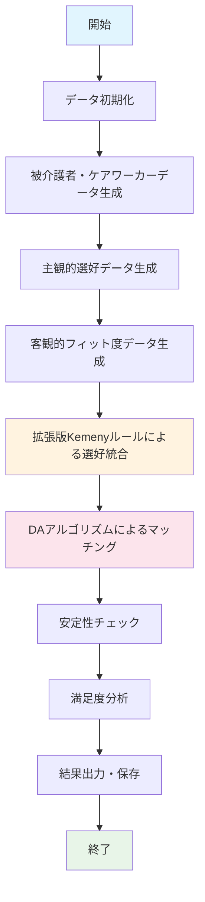
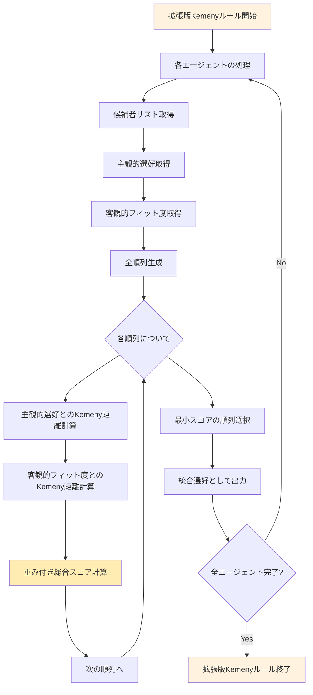
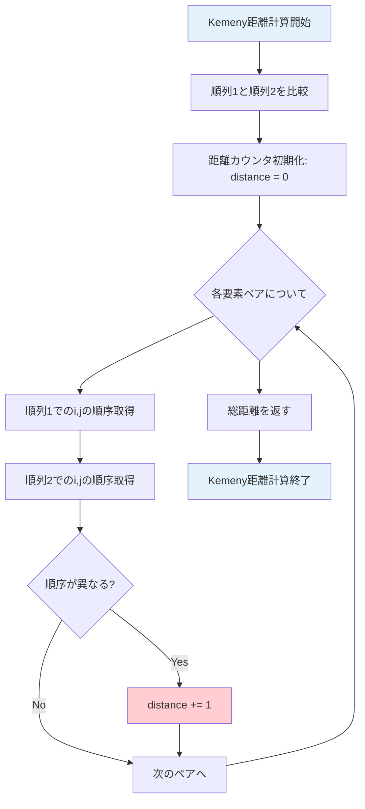
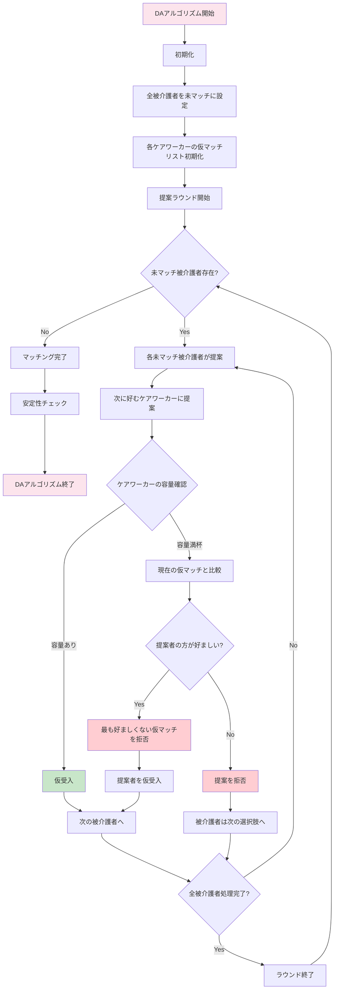
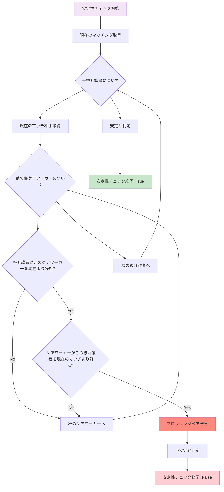
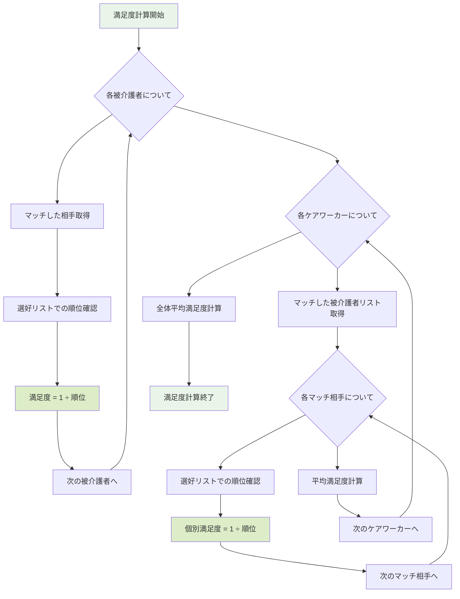
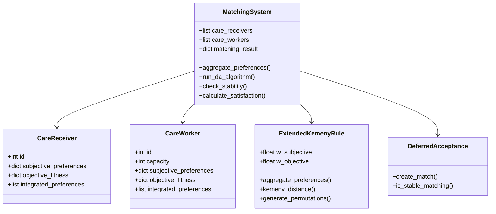
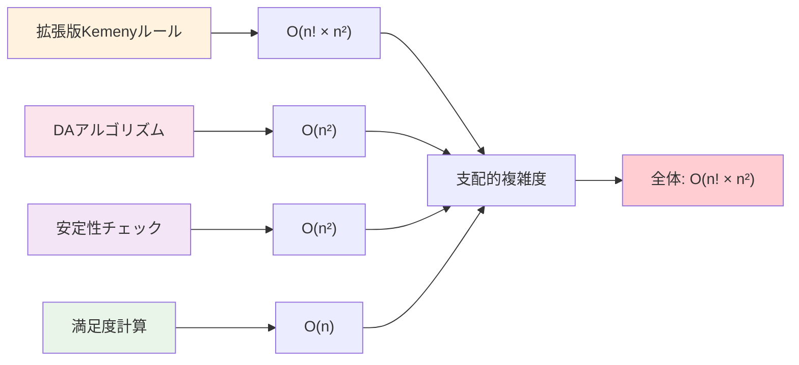

# ケアワーカー・被介護者マッチングシステム アルゴリズムフローチャート

## 全体システムフロー

```mermaid
flowchart TD
    A[開始] --> B[データ初期化]
    B --> C[被介護者・ケアワーカーデータ生成]
    C --> D[主観的選好データ生成]
    D --> E[客観的フィット度データ生成]
    E --> F[拡張版Kemenyルールによる選好統合]
    F --> G[DAアルゴリズムによるマッチング]
    G --> H[安定性チェック]
    H --> I[満足度分析]
    I --> J[結果出力・保存]
    J --> K[終了]
    
    style A fill:#e1f5fe
    style K fill:#e8f5e8
    style F fill:#fff3e0
    style G fill:#fce4ec
```

## 拡張版Kemenyルール詳細フロー

```mermaid
flowchart TD
    A1[拡張版Kemenyルール開始] --> B1[各エージェントの処理]
    B1 --> C1[候補者リスト取得]
    C1 --> D1[主観的選好取得]
    D1 --> E1[客観的フィット度取得]
    E1 --> F1[全順列生成]
    F1 --> G1{各順列について}
    G1 --> H1[主観的選好とのKemeny距離計算]
    H1 --> I1[客観的フィット度とのKemeny距離計算]
    I1 --> J1[重み付き総合スコア計算]
    J1 --> K1[次の順列へ]
    K1 --> G1
    G1 --> L1[最小スコアの順列選択]
    L1 --> M1[統合選好として出力]
    M1 --> N1{全エージェント完了?}
    N1 -->|No| B1
    N1 -->|Yes| O1[拡張版Kemenyルール終了]
    
    style A1 fill:#fff3e0
    style O1 fill:#fff3e0
    style J1 fill:#ffecb3
```

## Kemeny距離計算詳細

```mermaid
flowchart TD
    A2[Kemeny距離計算開始] --> B2[順列1と順列2を比較]
    B2 --> C2[距離カウンタ初期化: distance = 0]
    C2 --> D2{各要素ペアについて}
    D2 --> E2[順列1でのi,jの順序取得]
    E2 --> F2[順列2でのi,jの順序取得]
    F2 --> G2{順序が異なる?}
    G2 -->|Yes| H2[distance += 1]
    G2 -->|No| I2[次のペアへ]
    H2 --> I2
    I2 --> D2
    D2 --> J2[総距離を返す]
    J2 --> K2[Kemeny距離計算終了]
    
    style A2 fill:#e3f2fd
    style K2 fill:#e3f2fd
    style H2 fill:#ffcdd2
```

## DAアルゴリズム詳細フロー

```mermaid
flowchart TD
    A3[DAアルゴリズム開始] --> B3[初期化]
    B3 --> C3[全被介護者を未マッチに設定]
    C3 --> D3[各ケアワーカーの仮マッチリスト初期化]
    D3 --> E3[提案ラウンド開始]
    E3 --> F3{未マッチ被介護者存在?}
    F3 -->|No| G3[マッチング完了]
    F3 -->|Yes| H3[各未マッチ被介護者が提案]
    H3 --> I3[次に好むケアワーカーに提案]
    I3 --> J3{ケアワーカーの容量確認}
    J3 -->|容量あり| K3[仮受入]
    J3 -->|容量満杯| L3[現在の仮マッチと比較]
    L3 --> M3{提案者の方が好ましい?}
    M3 -->|Yes| N3[最も好ましくない仮マッチを拒否]
    M3 -->|No| O3[提案を拒否]
    N3 --> P3[提案者を仮受入]
    K3 --> Q3[次の被介護者へ]
    P3 --> Q3
    O3 --> R3[被介護者は次の選択肢へ]
    Q3 --> S3{全被介護者処理完了?}
    S3 -->|No| H3
    S3 -->|Yes| T3[ラウンド終了]
    T3 --> F3
    R3 --> S3
    G3 --> U3[安定性チェック]
    U3 --> V3[DAアルゴリズム終了]
    
    style A3 fill:#fce4ec
    style V3 fill:#fce4ec
    style K3 fill:#c8e6c9
    style N3 fill:#ffcdd2
    style O3 fill:#ffcdd2
```

## 安定性チェックフロー

```mermaid
flowchart TD
    A4[安定性チェック開始] --> B4[現在のマッチング取得]
    B4 --> C4{各被介護者について}
    C4 --> D4[現在のマッチ相手取得]
    D4 --> E4{他の各ケアワーカーについて}
    E4 --> F4{被介護者がこのケアワーカーを現在より好む?}
    F4 -->|No| G4[次のケアワーカーへ]
    F4 -->|Yes| H4{ケアワーカーがこの被介護者を現在のマッチより好む?}
    H4 -->|No| G4
    H4 -->|Yes| I4[ブロッキングペア発見]
    I4 --> J4[不安定と判定]
    J4 --> K4[安定性チェック終了: False]
    G4 --> E4
    E4 --> L4[次の被介護者へ]
    L4 --> C4
    C4 --> M4[安定と判定]
    M4 --> N4[安定性チェック終了: True]
    
    style A4 fill:#f3e5f5
    style K4 fill:#ffcdd2
    style N4 fill:#c8e6c9
    style I4 fill:#ff8a80
```

## 満足度計算フロー

```mermaid
flowchart TD
    A5[満足度計算開始] --> B5{各被介護者について}
    B5 --> C5[マッチした相手取得]
    C5 --> D5[選好リストでの順位確認]
    D5 --> E5[満足度 = 1 ÷ 順位]
    E5 --> F5[次の被介護者へ]
    F5 --> B5
    B5 --> G5{各ケアワーカーについて}
    G5 --> H5[マッチした被介護者リスト取得]
    H5 --> I5{各マッチ相手について}
    I5 --> J5[選好リストでの順位確認]
    J5 --> K5[個別満足度 = 1 ÷ 順位]
    K5 --> L5[次のマッチ相手へ]
    L5 --> I5
    I5 --> M5[平均満足度計算]
    M5 --> N5[次のケアワーカーへ]
    N5 --> G5
    G5 --> O5[全体平均満足度計算]
    O5 --> P5[満足度計算終了]
    
    style A5 fill:#e8f5e8
    style P5 fill:#e8f5e8
    style E5 fill:#dcedc8
    style K5 fill:#dcedc8
```

## データ構造関係図

```mermaid
classDiagram
    class CareReceiver {
        +int id
        +dict subjective_preferences
        +dict objective_fitness
        +list integrated_preferences
    }
    
    class CareWorker {
        +int id
        +int capacity
        +dict subjective_preferences
        +dict objective_fitness
        +list integrated_preferences
    }
    
    class MatchingSystem {
        +list care_receivers
        +list care_workers
        +dict matching_result
        +aggregate_preferences()
        +run_da_algorithm()
        +check_stability()
        +calculate_satisfaction()
    }
    
    class ExtendedKemenyRule {
        +float w_subjective
        +float w_objective
        +aggregate_preferences()
        +kemeny_distance()
        +generate_permutations()
    }
    
    class DeferredAcceptance {
        +create_match()
        +is_stable_matching()
    }
    
    MatchingSystem --> CareReceiver
    MatchingSystem --> CareWorker
    MatchingSystem --> ExtendedKemenyRule
    MatchingSystem --> DeferredAcceptance
```

## 時間複雑度分析

```mermaid
graph LR
    A[拡張版Kemenyルール] --> A1["O(n! × n²)"]
    B[DAアルゴリズム] --> B1["O(n²)"]
    C[安定性チェック] --> C1["O(n²)"]
    D[満足度計算] --> D1["O(n)"]
    
    A1 --> E[支配的複雑度]
    B1 --> E
    C1 --> E
    D1 --> E
    
    E --> F["全体: O(n! × n²)"]
    
    style A fill:#fff3e0
    style B fill:#fce4ec
    style C fill:#f3e5f5
    style D fill:#e8f5e8
    style F fill:#ffcdd2
```